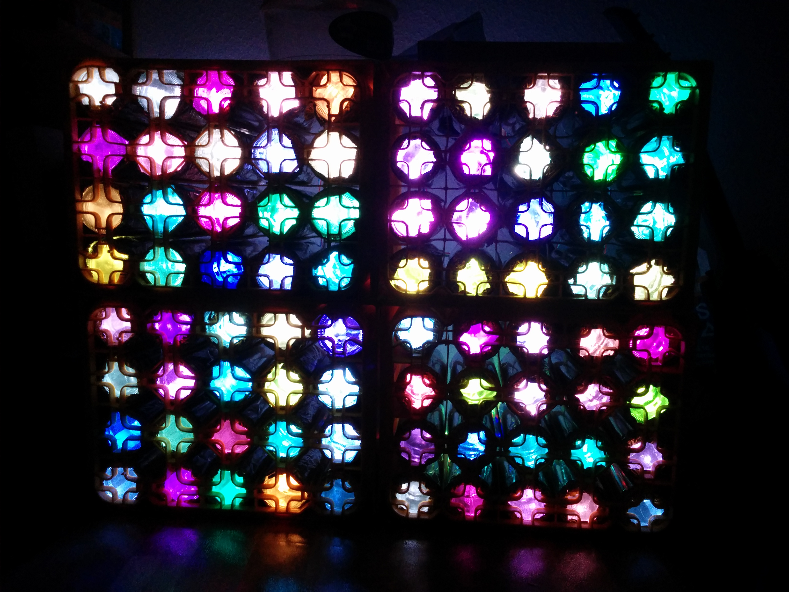

# Matelight
Code for running your very own Matelight! (Under Construction)

## Installation

You can install and run all code on a Raspberry Pi Model B.
For installation make sure you have Python3 installed on your Raspberry Pi and then just enter `pip install -r requirements.txt` to install all necessary libraries and dependencies.

## Hardware

The matelight has been created using a number of `WS2801 12 mm RGB LED Strings` and some empty crates of mate (thanks to @hrantzsch for providing the empty crates).
The whole thing is powered by an old PC power supply. A Raspberry Pi Model B with Arch Linux Arm handles displaying the data.

## Wiring

Coming Soon
